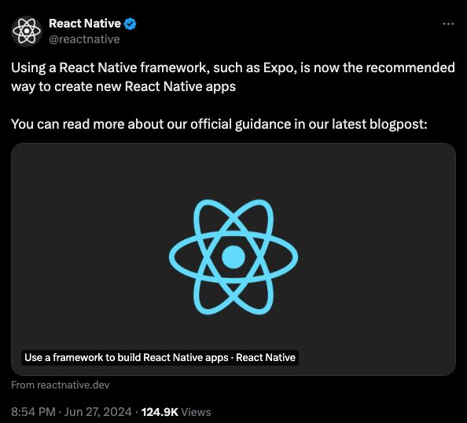

### [Официально] Использование фреймворка React Native, такого как Expo, в настоящее время является рекомендуемым способом создания новых приложений React Native. 📱

### Kурс по Expo (React Native)

[Посмотреть на канале. 🎓](https://t.me/Ok200Dev/20)

👤 Мое мнение об [Expo](https://expo.dev/) и [React Native](https://reactnative.dev/)

Я предпочитаю Expo (React Native) для разработки мобильных приложений и рекомендую его другим. 👍

Если вы хотите взглянуть на `React Native`, <a href="/blog/react-native-quick-look">прочтите этот пост</a>.

Многие разработчики ошибочно полагают, что компании используют React Native из-за его дешевизны, но многие богатые компании также полагаются на него, в том числе:

- Meta (Instagram, Messenger)
- Discord (основное приложение)
- Microsoft (Teams, Outlook)
- Tesla ([основное приложение](https://apps.apple.com/us/app/tesla/id582007913))

Если вы начинаете заниматься мобильной разработкой, я настоятельно рекомендую учить **Expo (React Native). 📚**

Для тех, кто не в курсе:

**Expo (React Nativea)** - это кроссплатформенный фреймворк, позволяющий создавать Android, iOS, а иногда и веб-приложения с использованием единой кодовой базы. Он использует систему компонентов, аналогичную React, но без DOM. 🌐

### В чем разница между React Native и Expo?

**React Native**

React Native - это фреймворк, разработанный Facebook, который позволяет разработчикам создавать мобильные приложения с использованием JavaScript и React. Он позволяет создавать по-настоящему нативные приложения путем прямой визуализации компонентов с использованием собственных API.

**Expo**

Expo - это фреймворк и платформа, построенные на базе React Native. Она призвана упростить процесс разработки, предоставляя набор инструментов и сервисов, которые "из коробки" решают многие распространенные задачи. Expo можно рассматривать как управляемый рабочий процесс для приложений React Native.

:::tip
Также Expo может создать навигационную систему приложения с файловой системой, как в Next JS
:::

### Kурс по Expo (React Native)

<a href="https://t.me/Ok200Dev/20" target="_blank">
  Посмотреть на канале.
</a>
