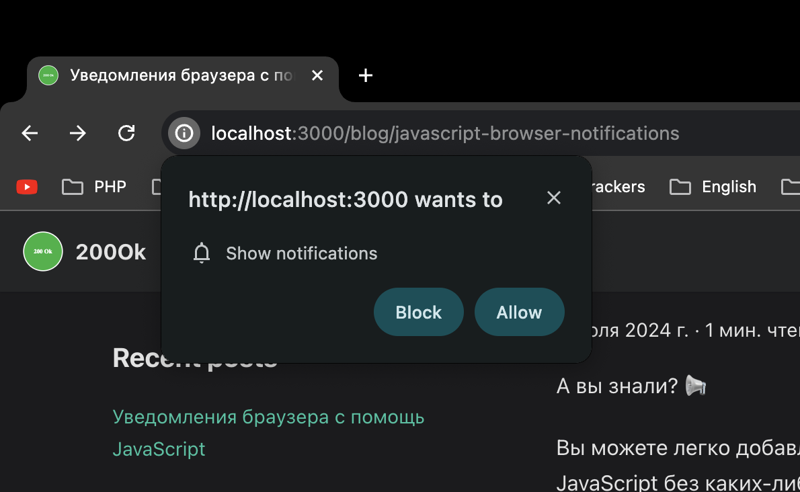

export function handleClick() {
    Notification.requestPermission().then((permission) => {
    if (permission === "granted") {
        new Notification("привет, мир!");
    }
    }); 
}

А вы знали? 📢

Вы можете легко добавлять уведомления в свои веб-приложения, используя ванильный JavaScript без каких-либо библиотек. 💻

Вот простой пример кода.
:::tip

```js
Notification.requestPermission().then((permission) => {
  if (permission === "granted") {
    new Notification("привет, мир!");
  }
});
```

<button onClick={handleClick}>Показать уведомление</button>

:::

К сожалению, пользователь должен включить уведомление, прежде чем оно будет показано.



Браузер автоматически предложит пользователю принимать уведомления от вашего веб-приложения при выполнении метода requestPermission. 📬
