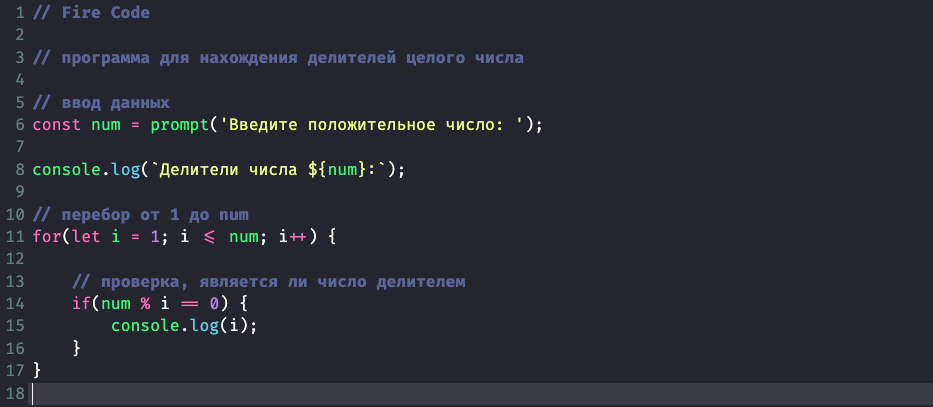
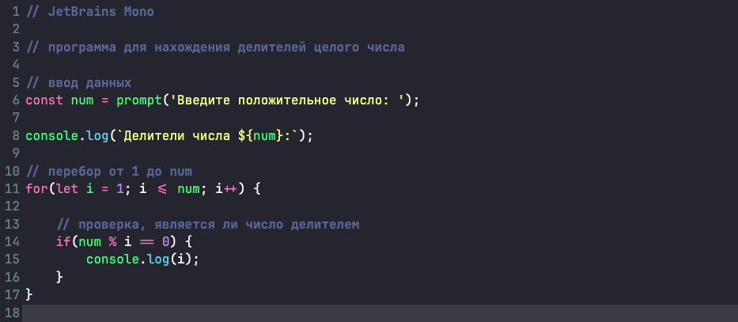
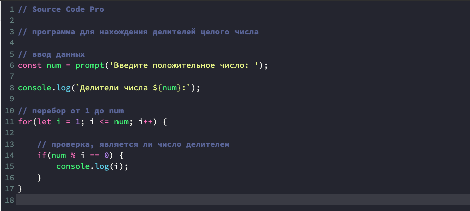
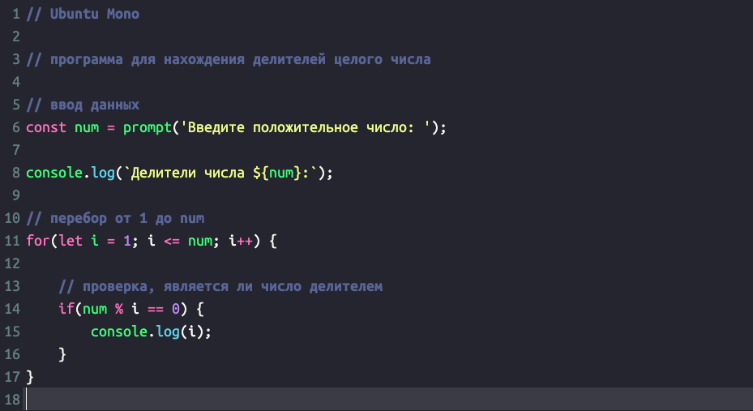
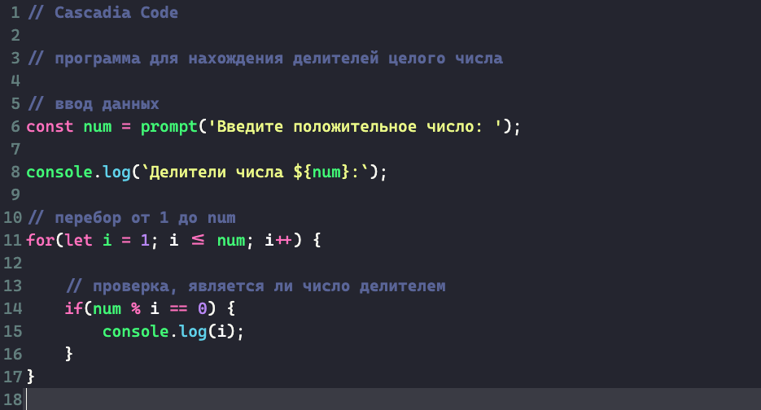

### Лучшие шрифты для программистов: улучшение читаемости и эстетики
В мире программирования, где ясность и эффективность являются приоритетами, выбор шрифта может значительно повлиять на продуктивность и комфорт разработчика.
 
Правильный шрифт может уменьшить нагрузку на глаза, улучшить читаемость кода и сделать долгие сессии кодирования более приятными.
 
В этом блоге мы рассмотрим некоторые из самых популярных шрифтов, которые используют программисты сегодня, подчеркивая их особенности и почему они пользуются спросом в сообществе разработчиков.

### 1. **Fira Code** ✨

**Fira Code** — популярный моноширинный шрифт с программными лигатурами. Эти лигатуры преобразуют общие многосимвольные комбинации в одиночные, визуально привлекательные символы. Например, `==` превращается в `≡`, а `!=` в `≠`. Эти преобразования могут сделать код более читаемым и уменьшить визуальный беспорядок.

**Особенности:**
- Программные лигатуры для улучшенной читаемости.
- Четкое различие между похожими символами (например, `0` и `O`, `1` и `l`).
- Доступен в различных начертаниях (light, regular, medium, bold).

**Почему программисты любят его:**
- Лигатуры ускоряют чтение и написание кода.
- Легкость для глаз при долгих сессиях кодирования.

### 2. **JetBrains Mono** 🖥️

**JetBrains Mono** — это шрифт, специально разработанный для разработчиков компанией JetBrains, создателями популярных IDE, таких как IntelliJ IDEA и PyCharm. Этот шрифт фокусируется на читаемости и снижении нагрузки на глаза, что делает его идеальным для длительных периодов кодирования.

**Особенности:**
- Увеличенная высота строчных букв для лучшей читаемости.
- Четкое различие между похожими символами.
- Поддержка программных лигатур.

**Почему программисты любят его:**
- Разработан компанией, которая глубоко понимает потребности разработчиков.
- Несколько увеличенная x-высота улучшает читаемость.

### 3. **Source Code Pro** 📄

**Source Code Pro** — это шрифт с открытым исходным кодом, созданный Adobe. Он стремится улучшить читаемость и сделать код более эстетичным.

**Особенности:**
- Сбалансированный интервал между символами.
- Четкое различие между легко путаемыми символами.
- Отсутствие программных лигатур, что делает его простым и понятным.

**Почему программисты любят его:**
- Чистый и профессиональный вид.
- Отсутствие лигатур предпочитают некоторые разработчики, находящие их отвлекающими.

### 4. **Ubuntu Mono** 🐧

**Ubuntu Mono** — это стандартный моноширинный шрифт для операционной системы Ubuntu. Он разработан для того, чтобы быть легким для глаз и обеспечивать отличную читаемость.

**Особенности:**
- Уникальный стиль, который отличает его от других моноширинных шрифтов.
- Четкое различие между символами.
- Доступен в обычном и жирном начертаниях.

**Почему программисты любят его:**
- Его уникальный дизайн придает свежий вид коду.
- Оптимизирован для экранного отображения, снижая нагрузку на глаза.

### 5. **Cascadia Code** 🌟

**Cascadia Code** — это современный моноширинный шрифт от Microsoft, специально разработанный для кодирования. Он включает в себя программные лигатуры и поддерживает символы Powerline, делая его универсальным для различных сред кодирования.

:::tip
Cascadia Code - это основной шрифт VS Code
:::

**Особенности:**
- Программные лигатуры для улучшенной читаемости кода.
- Поддержка символов Powerline для интерфейсов командной строки.
- Четкий и стильный дизайн.

**Почему программисты любят его:**
- Лигатуры и поддержка символов улучшают опыт кодирования.
- Его современный дизайн выглядит отлично в любом IDE или терминале.

--- 

### Заключение

Выбор правильного шрифта — это личное решение каждого программиста, так как он зависит от индивидуальных предпочтений и конкретных требований кода. Независимо от того, предпочитаете ли вы лигатуры Fira Code, четкость JetBrains Mono или простоту Source Code Pro, существует идеальный шрифт, который улучшит ваш опыт кодирования. Экспериментируйте с этими опциями, чтобы найти тот, который подходит вам лучше всего, и наслаждайтесь более комфортным и эффективным процессом программирования.
