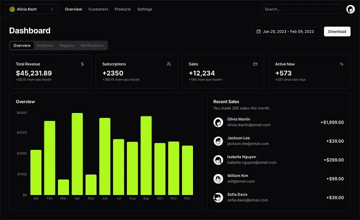

### Что такое Shadcn UI?

Shadcn UI - это фреймворк пользовательского интерфейса (UI). Фреймворк пользовательского интерфейса - это набор инструментов и компонентов, которые помогают разработчикам создавать красивые и функциональные веб-сайты и приложения.

<div class="text--center"></div>

### Зачем использовать Shadcn UI?

1. **Простота в использовании:** Shadcn UI разработан таким образом, чтобы быть простым и интуитивно понятным. Это означает, что вам не нужно быть экспертом в программировании, чтобы им пользоваться.
2. **Настраиваемый: вы можете легко изменить внешний вид своего веб-сайта в соответствии с вашим брендом или личным стилем.**
3. **Адаптивный дизайн: Ваш веб-сайт будет отлично смотреться на всех устройствах, будь то телефон, планшет или настольный компьютер.**
4. **Готовые компоненты: **Shadcn UI содержит множество готовых компонентов, таких как `кнопки`, `формы` и `панели навигации`. Это экономит ваше время и усилия.\

### Начало работы с Shadcn UI

Вот основные шаги, чтобы начать использовать Shadcn UI в вашем проекте:

1. Установка: Сначала вам необходимо установить Shadcn UI. Вы можете сделать это с помощью менеджера пакетов `npx`

```bash
npx shadcn-ui@latest init
```

:::tip
Это сработает, если вы используете JS-фреймворки, такие как `NextJS`, `React`, `Vite`

Если вы используете что-то другое, просто ознакомьтесь с [официальной документацией](https://ui.shadcn.com/docs/installation) по установке вашего приложения.
:::

2. После установки вам необходимо добавить компоненты `Shadcn-UI` в свое приложение.

#### Вот пример того, как добавить компонент кнопки.

```bash
npx shadcn-ui@latest add button
```

```jsx
import { Button } from "shadcn-ui";

function App() {
  return (
    <div>
      <Button>Click Me</Button>
    </div>
  );
}

export default App;
```

3. Настройка компонентов: Вы можете настроить компоненты в соответствии с вашими потребностями. Shadcn-UI предоставляет различные опции и стили, которые вы можете применить. Например, для изменения цвета кнопки:

```jsx
import { Button } from "shadcn-ui";

function App() {
  return (
    <div>
      // highlight-next-line
      <Button style={{ backgroundColor: "blue", color: "white" }}>
        Click Me
      </Button>
    </div>
  );
}

export default App;
```

### Советы по использованию Shadcn-UI

- [Ознакомьтесь с документацией:](https://ui.shadcn.com/docs) В Shadcn UI есть отличная документация, в которой объясняется, как использовать каждый компонент. Это отличный ресурс, если вы застряли или нуждаетесь в дополнительной информации.
- Экспериментируйте: Не бойтесь пробовать разные стили и компоненты. Экспериментирование - лучший способ узнать и найти то, что лучше всего подходит для вашего проекта.

### Заключение

Shadcn UI - это мощный и простой в использовании инструмент для создания потрясающих веб-сайтов и приложений. Независимо от того, являетесь ли вы новичком или опытным разработчиком, Shadcn UI поможет вам воплотить ваши идеи в жизнь.

В этой статье я только познакомил вас с Shadcn, вы должны прочитать документацию с [официального сайта](https://ui.shadcn.com/docs), чтобы начать ее использовать.
