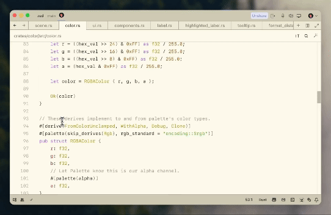

В постоянно развивающемся мире разработки программного обеспечения правильные инструменты могут значительно повлиять на продуктивность и качество кода. Один из таких инструментов, который привлекает внимание сообщества разработчиков, - это редактор Zed.

В этом посте мы рассмотрим, что делает Zed уникальным и почему вам стоит рассмотреть возможность его использования.

### Что такое редактор Zed?

Zed - это современный, [открытый](https://github.com/zed-industries/zed) текстовый редактор, разработанный специально для кодирования. Он стремится обеспечить быстрый, эффективный и безотвлекающий рабочий процесс для разработчиков. С акцентом на производительность и простоту, Zed предлагает уникальное сочетание функций, которые подходят как для новичков, так и для опытных программистов.

### Поддержка ИИ

Экономьте время и количество нажатий клавиш, генерируя код с помощью ИИ. Zed поддерживает `GitHub Copilot` «из коробки». Также вы можете использовать `GPT-4` для генерации или рефакторинга кода, нажав `ctrl-enter` и набрав подсказку на естественном языке.

### Основные функции редактора Zed

#### 1. Молниеносная производительность

Одна из выдающихся особенностей Zed - это его скорость. Разработанный с учетом производительности, Zed быстро загружается и легко справляется с большими файлами. Независимо от того, работаете ли вы над небольшим скриптом или массивной кодовой базой, Zed гарантирует, что вас не затормозит медленная работа.

#### 2. Минималистичный интерфейс

Интерфейс Zed чистый и минималистичный, созданный для того, чтобы минимизировать отвлекающие факторы. Редактор ориентирован на предоставление упрощенного опыта, который позволяет вам сосредоточиться на коде. Отсутствие ненужного беспорядка делает его легче для навигации и быстрого нахождения нужного.

#### 3. Мощные возможности редактирования

Несмотря на свою простоту, Zed наполнен мощными функциями редактирования. Он поддерживает [множественные курсоры](https://zed.dev/docs/assistant-panel?highlight=cursor#multiple-cursor-demo), позволяя редактировать код одновременно в разных местах. Редактор также предлагает надежные функции поиска и замены, что упрощает внесение изменений по всему проекту.

#### 4. Расширяемость

Zed очень расширяем благодаря своей системе плагинов. Вы можете настроить редактор под свой рабочий процесс, устанавливая плагины, которые добавляют новые функции или улучшают существующие. Активное сообщество вокруг Zed постоянно разрабатывает и делится плагинами, обеспечивая возможность адаптации редактора под ваши конкретные потребности.

#### 5. Кросс-платформенная совместимость

Независимо от того, используете ли вы `Windows`, `macOS` или `Linux`, Zed подойдет вам. Редактор является кросс-платформенным, обеспечивая единообразный опыт работы на любой операционной системе. Эта гибкость делает его отличным выбором для разработчиков, работающих в различных средах.

### Начало работы с Zed

Готовы попробовать Zed? Вот как вы можете начать:

1. **Скачайте и установите:** Перейдите на [официальный сайт Zed](https://zed.dev) и скачайте установочный файл для вашей операционной системы. Следуйте инструкциям по установке, чтобы настроить редактор на вашем компьютере.

2. **Исследуйте интерфейс:** Потратьте немного времени на изучение минималистичного интерфейса Zed. Ознакомьтесь с базовой компоновкой и функциями.

3. **Настройте свою установку:** Посетите репозиторий плагинов Zed, чтобы найти плагины, которые могут улучшить ваш опыт кодирования. Установите те, которые соответствуют вашему рабочему процессу, и настройте свою установку.

4. **Начните кодировать:** Откройте свой проект в Zed и начните кодировать. Воспользуйтесь мощными функциями редактирования и наслаждайтесь безотвлекающей средой.

### Заключение

Редактор Zed - это фантастический инструмент для разработчиков который поддерживает Github Copilot и GPT-4. Его минималистичный дизайн, мощные функции и кросс-платформенная совместимость делают его достойным дополнением к набору инструментов любого разработчика. Попробуйте Zed и посмотрите, как он может преобразовать ваш опыт кодирования.
